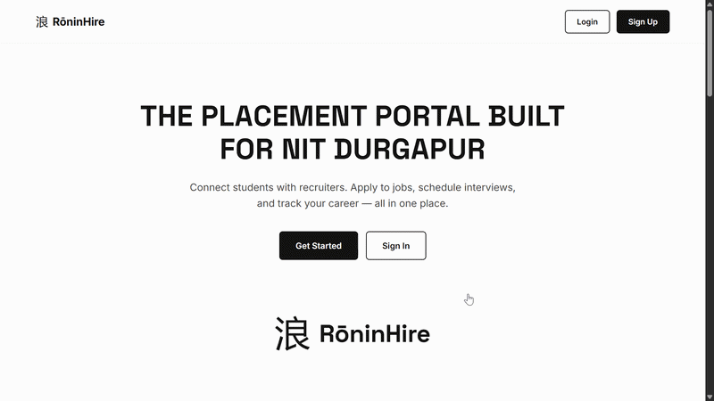
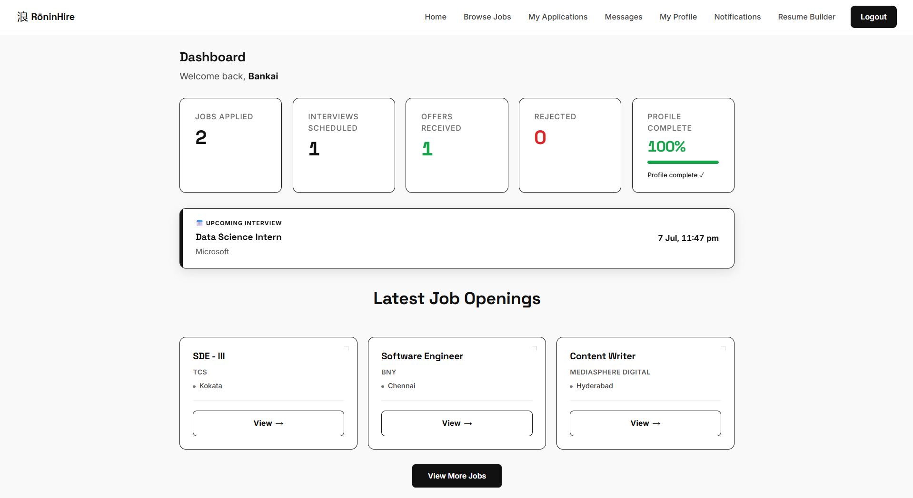
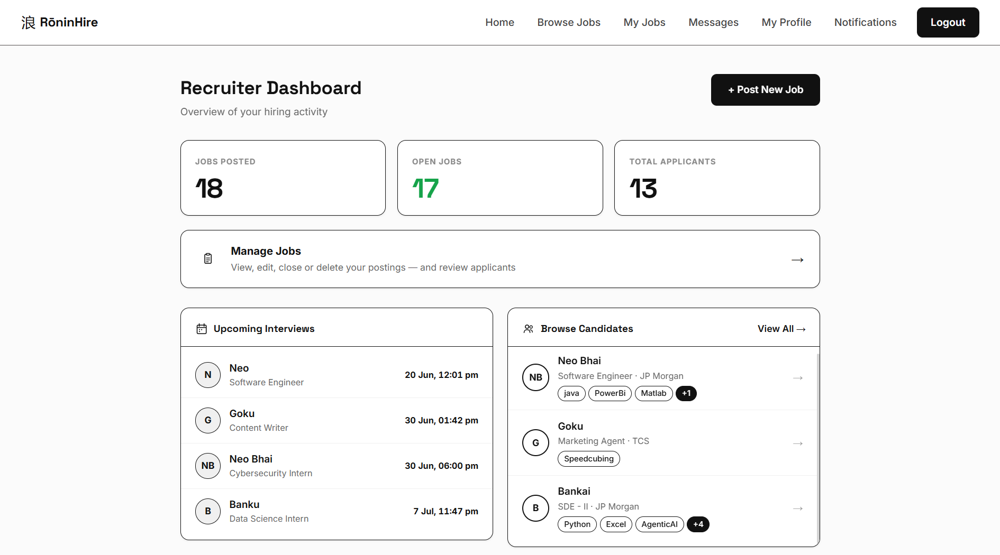
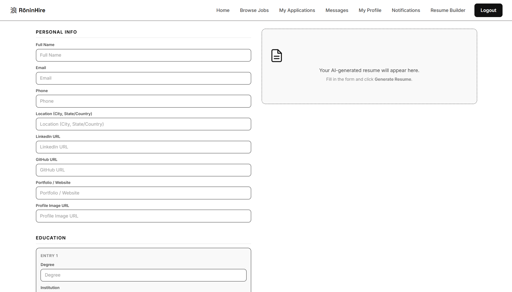
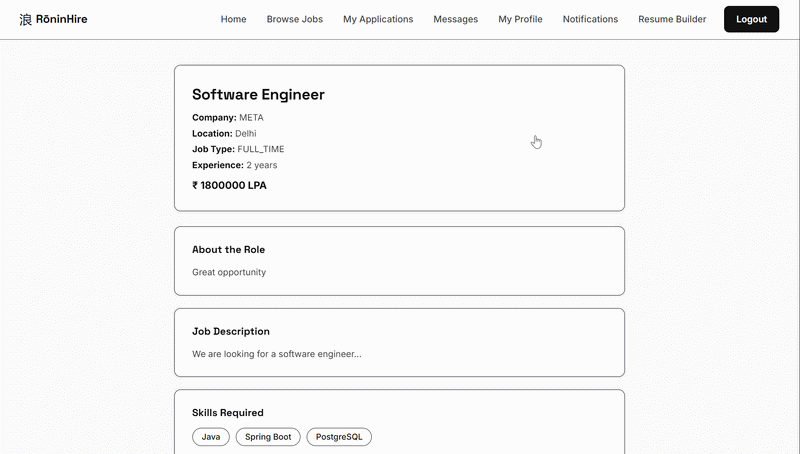
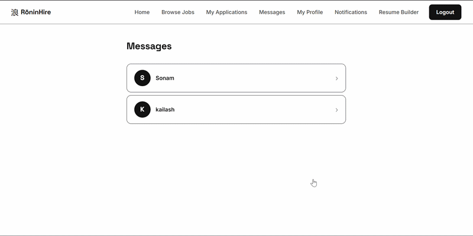
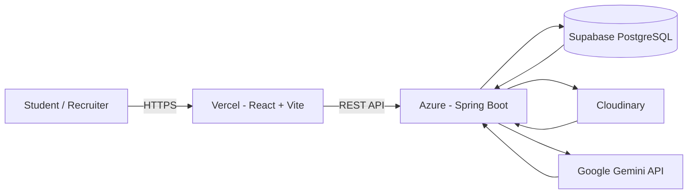

# RōninHire (浪)

**A full-stack placement portal built for NIT Durgapur's GLUG club.**

🔗 **Live site:** [ronin-hire.vercel.app](https://www.ronin-hire.vercel.app)

---

## What this is

RōninHire connects students with recruiters for campus placements. Students build profiles, browse jobs, apply, track their application status, chat with recruiters, and read anonymous interview experiences from people who actually sat through the process. Recruiters post jobs, review applicants, schedule interviews, and manage the whole pipeline from one dashboard.

I started this as a way to learn Spring Boot and React properly, following a tutorial series for the first couple of weeks. Around week two it stopped being a tutorial project and turned into something I wanted to finish and ship on my own. Everything from the JWT security layer onward is my own design.

## Project at a glance

- 53 REST API endpoints
- 9 backend modules
- JWT authentication with role-based authorization
- AI-powered ATS resume generation using Google Gemini
- Dockerized full-stack deployment




---

## Features

### For students
- Register with a college email. The system checks for `@nitdgp.ac.in` on applicant accounts specifically. Recruiters can sign up with any email.
- Build a full profile: skills, work experience, certifications, profile picture, cover photo, resume, all stored via Cloudinary.
- Browse and filter open jobs by title, company, location, and job type.
- Apply to jobs with a custom cover letter and resume link.
- Track every application's status in real time: Applied, Interviewing, Offered, Rejected.
- Get notified the moment a recruiter changes your status or a new job matching your role opens up.
- Chat directly with the recruiter for any job you've applied to.
- Read anonymous interview experiences shared by past applicants for a specific job, and leave your own once you're eligible.
- Generate a resume with AI. It pulls whatever it can from your existing profile, lets you fill in the gaps, and hands back a clean, ATS-friendly resume you can download as a PDF.

### For recruiters
- Post, edit, close, and reopen job listings.
- Review every applicant for a job in one place, with full contact info and resume access.
- Change application status and schedule interviews with a specific date and time.
- Browse the entire candidate pool, not just people who applied to your jobs.
- View any candidate's full profile, read-only.
- Chat with applicants directly.
- See a dashboard with real numbers: jobs posted, open roles, total applicants, and upcoming interviews pulled straight from your job data.

---

## Screenshots

| | | |
|---|---|---|
|  |  | 
| *Student Dashboard* | *Recruiter Dashboard* | *Resume Generator* |
|  |  | 
| *Job Details and Reviews* | *Messaging* | *Posted Jobs* |


---

## Tech stack

**Backend**
- Java 21, Spring Boot 3.5.x
- Spring Security with JWT (JJWT 0.12.6)
- Spring Data JPA and PostgreSQL
- Cloudinary for file storage (profile pictures, resumes, cover photos)
- Google Gemini API for the AI resume builder

**Frontend**
- React 18 with Vite
- Plain CSS, no component libraries, no Tailwind
- Plain `fetch`, no Axios
- No Redux. State is handled with `useState` and localStorage
- No TypeScript

**Infrastructure**
- Docker, with multi-stage builds for both backend and frontend, orchestrated with `docker-compose`
- Nginx serving the frontend build with SPA routing and API proxying
- PostgreSQL hosted on Supabase
- Backend on Azure, frontend on Vercel

I kept the frontend deliberately light on dependencies. No Redux, no Axios, no TypeScript. Not because I have anything against them. I wanted to understand what React and the browser fetch API actually do without a framework doing the thinking for me. That constraint made some things slower to build and made other things much easier to debug.

## Backend & Deployment

### Backend

- 53 REST API endpoints
- 9 API modules
- Spring Security with JWT
- PostgreSQL database
- Cloudinary integration
- Google Gemini integration

### Deployment

- Dockerized backend and frontend
- Azure (Spring Boot API)
- Vercel (React frontend)
- Supabase PostgreSQL
- Nginx reverse proxy

## Architecture



## API Documentation

Complete API documentation generated directly from the backend is included in this repository.

- **OpenAPI Documentation:** [`docs/API Documentation.pdf`](./docs/API%20documentation%20v1.pdf)

The backend currently exposes **53 REST endpoints** across **9 modules**, covering authentication, jobs, profiles, chat, notifications, interview experiences, assessments, and AI resume generation.

---

## Security notes

A few decisions here weren't obvious to me starting out, so I want to call them out specifically:

- **Nothing that identifies a user is ever trusted from the request body.** `postedBy` on a job, `applicantId` on an application, `userId` on a chat message, `profileId` on a profile update: all of it comes from the JWT on the server side, never from what the client sends. A user cannot pass someone else's ID and act on their behalf, because the ID they'd need to fake isn't read from anywhere the client controls.
- **Interview reviews are genuinely anonymous.** There's no `userId` field exposed anywhere in the review DTO. The backend enforces one review per user per job through the database, but nothing in the API response ever tells you who wrote what.
- **Review eligibility is checked server-side, not just hidden in the UI.** You can only leave a review for a job if you were actually offered, rejected, or interviewed with the interview time already in the past. Sending a request straight to the API without going through the UI does not get around this.
- Every mutating endpoint has role-based access control through `@PreAuthorize`, checked against the account type embedded in the JWT at login.

I want to be upfront that this is not hardened against a serious attacker. There's no rate limiting, no refresh token rotation, and the JWT signing key currently regenerates on every backend restart, which invalidates all active sessions when that happens. For a project at this stage, the goal was making sure the basic attack a curious classmate might try, editing a request in dev tools to look at or modify someone else's data, doesn't work. It doesn't.

---

## Getting started locally

**Requirements:** Docker and Docker Compose

```bash
git clone https://github.com/devsenjai404/placement-portal.git
cd placement-portal
cp .env.example .env
# fill in your own DB credentials, Cloudinary keys, and Gemini API key in .env
docker-compose up --build
```

The frontend will be available on `localhost`, and the backend on port `8080`. PostgreSQL runs in its own container and the backend waits for it to be healthy before starting.

---

## Known limitations

Things I know about and haven't fixed yet:

- The JWT signing key is generated in memory and regenerates on every backend restart. If the container restarts, every logged-in user gets kicked out and needs to log in again.
- An expired token currently redirects to a 404 page instead of back to login. Annoying but not a security issue.
- Mobile responsiveness is inconsistent across pages. Some pages, like the landing page and job cards, are fully responsive. Others still assume a desktop viewport.
- `MyApplications` fetches every open job and filters client-side to find the ones you applied to, instead of hitting a dedicated endpoint. Works fine at the current scale, would not scale to thousands of job postings.
- CORS configuration is not fully centralized yet. Some of it is still per-controller.

None of these are hidden. I'd rather list them here than have someone find them first.

---

## Roadmap

The backend is further along than the frontend on a couple of these:

- **Assessment frontend.** The backend implementation is already complete, including timed assessments, question management, negative marking, shuffled question order, attempt tracking, and result evaluation. The remaining work is building the student and recruiter interfaces.
- Google OAuth login
- Email OTP for password reset and login verification
- Real-time chat over WebSockets, replacing the current 3-second polling approach
- Company profiles with a verification step for recruiters
- Job and company ratings
- An admin role for moderating listings and reviews

---

## Project structure

```
placement-portal/
├── backend/
│   ├── src/main/java/com/jobportal/
│   │   ├── api/          : REST controllers
│   │   ├── service/      : business logic
│   │   ├── repository/   : Spring Data JPA repositories
│   │   ├── entity/       : JPA entities
│   │   ├── dto/          : request/response objects
│   │   ├── jwt/          : JWT generation, filters, auth
│   │   └── utility/      : SecurityUtils, exception handling
│   └── Dockerfile
├── frontend/
│   ├── src/
│   │   ├── pages/        : one file per route
│   │   ├── components/   : shared components (Navbar, JobCard, StatusBadge...)
│   │   └── api.js        : single source of truth for the backend base URL
│   └── Dockerfile
├── docs/
│   └── API Documentation v1.pdf
└── docker-compose.yml
```

---

## Contact

Found a bug, or have feedback?

- **Feedback form:** [forms.gle/LS32ZvEyxMu3vaRx7](https://forms.gle/LS32ZvEyxMu3vaRx7)
- **Email:** support.roninhire@gmail.com

---

## License

MIT. Do whatever you want with it.

---

*Built by DEVSENSEI404. Everything here, the backend, the security decisions, the frontend, the AI resume builder, is one person's work, built to learn, then built to actually ship.*
